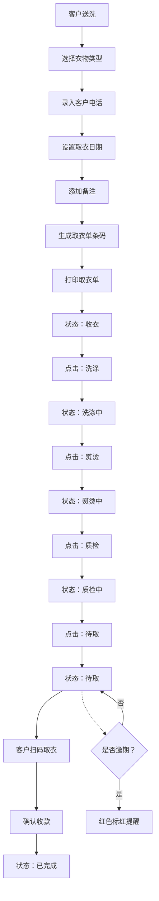

## 1. 产品概述

干洗店衣物收发与状态追踪管理系统，帮助小型干洗店高效管理衣物收发流程、状态追踪、客户信息和经营数据统计。

- 解决干洗店人工记录易出错、状态追踪不清晰、逾期取衣提醒不及时的痛点
- 目标用户：干洗店店主及店员，提升运营效率和客户服务质量

## 2. 核心功能

### 2.1 用户角色

| 角色 | 注册方式 | 核心权限 |
|------|----------|----------|
| 店员 | 系统默认登录 | 收衣登记、状态变更、取衣查询、查看统计 |
| 店主 | 系统默认登录 | 全部功能权限、数据统计分析 |

### 2.2 功能模块

1. **收衣登记页面**：衣物类型选择、客户电话录入、价格设置、取衣日期、备注信息、条码生成与打印
2. **状态管理页面**：衣物列表展示、状态一键变更（收衣→洗涤→熨烫→质检→待取）、逾期提醒
3. **取衣查询页面**：条码扫码/输入查询、衣物详情展示、取衣确认
4. **统计分析页面**：月度收衣量统计、衣物类型占比、收入统计、趋势图表

### 2.3 页面详情

| 页面名称 | 模块名称 | 功能描述 |
|----------|----------|----------|
| 收衣登记 | 衣物信息录入 | 下拉选择衣物类型（西装、大衣、羽绒服、裙装、衬衫），自动带出默认价格，支持手动调整 |
| 收衣登记 | 客户信息录入 | 输入客户手机号，支持历史客户快速匹配 |
| 收衣登记 | 取衣单打印 | 自动生成唯一条码，打印包含衣物信息、客户电话、取衣日期、价格的取衣单 |
| 收衣登记 | 客户备注 | 记录特殊洗濯要求，如"有污渍需特殊处理" |
| 状态管理 | 衣物列表 | 卡片式展示所有在洗衣物，按状态分组，显示逾期提醒（红色标记） |
| 状态管理 | 状态变更 | 每个衣物卡片有状态流转按钮，点击即可更新状态，记录操作时间 |
| 取衣查询 | 扫码查询 | 支持扫码枪输入条码，快速定位衣物，显示当前状态和应付金额 |
| 取衣查询 | 取衣确认 | 确认取衣后更新状态为"已完成"，记录取衣时间 |
| 统计分析 | 数据概览 | 本月收衣总数、总收入、热门衣物类型Top3 |
| 统计分析 | 图表展示 | 柱状图展示每日收衣量，饼图展示衣物类型占比 |

## 3. 核心流程

### 收衣流程
客户送洗衣物 → 店员选择衣物类型 → 录入客户电话 → 设置取衣日期（默认3天后）→ 输入备注（可选）→ 系统生成条码和取衣单 → 打印取衣单交给客户

### 洗护流程
衣物进入洗涤环节 → 洗涤完成点击"熨烫" → 熨烫完成点击"质检" → 质检通过点击"待取" → 系统等待客户取衣

### 取衣流程
客户出示取衣单 → 扫描条码/手动输入 → 系统显示衣物状态和金额 → 确认收款 → 点击"完成取衣" → 更新状态为已完成

### 逾期提醒
系统每日检查待取衣物 → 超过约定取衣日期的标红显示 → 店员可一键拨打客户电话

## 4. 用户界面设计

### 4.1 设计风格

**设计理念**：专业高效、简洁清爽的干洗店管理界面，采用清新的蓝色调传递专业感，搭配温暖的橙色作为强调色。

- **主色调**：`#165DFF`（专业蓝）- 代表信赖和专业
- **辅助色**：`#FF7D00`（温暖橙）- 用于按钮和重要操作
- **状态色**：
  - 收衣：`#165DFF`
  - 洗涤：`#722ED1`
  - 熨烫：`#0FC6C2`
  - 质检：`#14C9C9`
  - 待取：`#00B42A`
  - 已完成：`#86909C`
  - 逾期：`#F53F3F`（红色标红）
- **背景色**：`#F7F8FA`（浅灰背景），卡片使用纯白色
- **字体**：
  - 标题：`Noto Sans SC` 加粗，字号 20-28px
  - 正文：`Noto Sans SC` 常规，字号 14px
  - 数字/金额：`JetBrains Mono` 等宽字体，突出数据
- **按钮风格**：圆角 8px，带轻微阴影，hover时有上浮效果
- **布局风格**：顶部导航 + 侧边标签切换 + 卡片式内容区
- **图标风格**：使用简洁的线性图标，搭配状态色

### 4.2 页面设计概览

| 页面名称 | 模块名称 | UI元素 |
|----------|----------|--------|
| 收衣登记 | 表单区域 | 大卡片容器，下拉选择器、输入框、日期选择器、文本域，橙色提交按钮 |
| 收衣登记 | 打印预览 | 右侧实时预览取衣单样式，条码居中显示，信息清晰 |
| 状态管理 | 状态筛选 | 顶部状态标签栏，点击可筛选对应状态的衣物 |
| 状态管理 | 衣物卡片 | 每个衣物为独立卡片，左侧显示条码缩略图，右侧显示详情，底部是状态流转按钮 |
| 状态管理 | 逾期提醒 | 逾期卡片左上角红色角标，整体红色边框 |
| 取衣查询 | 扫码区域 | 大输入框支持扫码枪自动输入，蓝色搜索按钮 |
| 取衣查询 | 结果展示 | 卡片展示衣物详情，状态标签醒目，金额用大号字体显示 |
| 统计分析 | 数据概览 | 三个大数字卡片，分别显示收衣量、收入、热门类型 |
| 统计分析 | 图表区域 | 左侧柱状图、右侧饼图，配色与主色调统一 |

### 4.3 响应式

- **桌面端优先**：主内容区最小宽度 1200px，适配干洗店常用的电脑屏幕
- **平板适配**：在 768px-1199px 宽度下，卡片自动调整为 2 列布局
- **触控优化**：按钮最小点击区域 44x44px，支持触屏设备操作
- **打印优化**：专门的打印样式，取衣单打印时隐藏导航和其他无关元素

### 4.4 交互动效

- 页面加载时，卡片依次淡入（staggered animation），延迟 50ms 逐个出现
- 状态变更时，卡片有轻微的缩放和颜色过渡动画
- 按钮 hover 时有 2px 上浮效果和阴影加深
- 扫码查询时，输入框有呼吸灯效果提示聚焦
- 逾期卡片有轻微的脉冲动画，提醒店员注意
