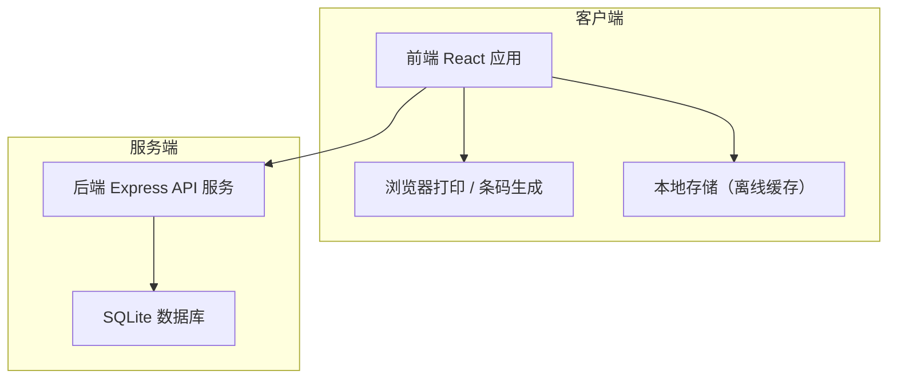
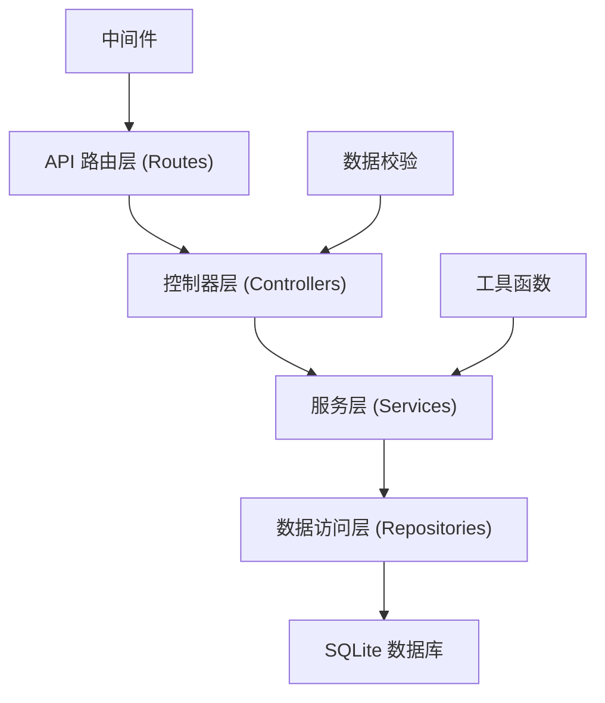
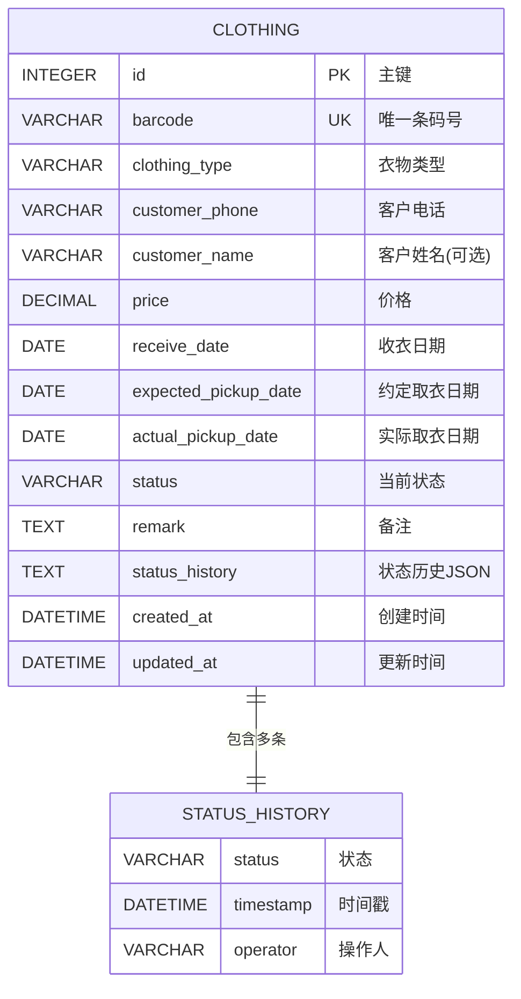

## 1. 架构设计

本系统采用前后端分离架构，前端负责界面展示和交互，后端提供API服务和数据持久化。考虑到小型干洗店的使用场景，采用轻量级技术栈，部署简单，维护方便。



## 2. 技术描述

### 技术选型理由
- **React 18**：组件化开发，生态丰富，适合快速构建管理界面
- **TypeScript**：类型安全，减少运行时错误，提高代码可维护性
- **Vite**：构建速度快，开发体验好
- **Tailwind CSS 3**：原子化CSS，快速构建UI，样式统一
- **Express 4**：轻量级Node.js Web框架，API开发效率高
- **SQLite 3**：无需独立数据库服务，单文件存储，部署简单，适合小型应用
- **JsBarcode**：纯JS条码生成库，支持多种条码格式
- **Recharts**：React图表库，内置多种图表类型，易用性好

### 完整技术栈
- **前端**：React@18 + TypeScript + Tailwind CSS@3 + Vite
- **初始化工具**：vite-init
- **后端**：Express@4 + TypeScript
- **数据库**：SQLite3 + better-sqlite3
- **条码生成**：jsbarcode
- **图表**：recharts
- **路由**：react-router-dom
- **HTTP客户端**：axios
- **图标**：@ant-design/icons

## 3. 路由定义

| 路由路径 | 页面名称 | 功能说明 |
|----------|----------|----------|
| `/` | 收衣登记 | 衣物信息录入、客户信息、生成取衣单并打印 |
| `/status` | 状态管理 | 衣物列表、状态流转、逾期提醒 |
| `/pickup` | 取衣查询 | 扫码查询、取衣确认 |
| `/statistics` | 统计分析 | 月度数据统计、图表展示 |

## 4. API 定义

### 数据类型定义

```typescript
// 衣物状态枚举
type ClothingStatus = 'received' | 'washing' | 'ironing' | 'inspecting' | 'waiting' | 'completed';

// 衣物类型枚举
type ClothingType = 'suit' | 'coat' | 'downjacket' | 'dress' | 'shirt';

// 衣物实体
interface Clothing {
  id: number;
  barcode: string;           // 唯一条码号
  clothingType: ClothingType;
  customerPhone: string;
  customerName?: string;
  price: number;
  receiveDate: string;       // 收衣日期 ISO格式
  expectedPickupDate: string; // 约定取衣日期
  actualPickupDate?: string;  // 实际取衣日期
  status: ClothingStatus;
  remark?: string;            // 客户备注
  statusHistory: StatusRecord[];
  createdAt: string;
  updatedAt: string;
}

// 状态流转记录
interface StatusRecord {
  status: ClothingStatus;
  timestamp: string;
  operator?: string;
}

// 月度统计数据
interface MonthlyStats {
  totalCount: number;
  totalRevenue: number;
  typeStats: { type: ClothingType; count: number }[];
  dailyStats: { date: string; count: number; revenue: number }[];
  overdueCount: number;
}
```

### API 接口列表

| 方法 | 路径 | 请求参数 | 响应 | 说明 |
|------|------|----------|------|------|
| POST | `/api/clothing` | `{ clothingType, customerPhone, price, expectedPickupDate, remark }` | `Clothing` | 登记新衣物 |
| GET | `/api/clothing` | `status?: ClothingStatus, page?: number, pageSize?: number` | `{ list: Clothing[], total: number }` | 获取衣物列表，支持按状态筛选 |
| GET | `/api/clothing/:barcode` | - | `Clothing` | 根据条码查询衣物详情 |
| PUT | `/api/clothing/:id/status` | `{ status: ClothingStatus }` | `Clothing` | 更新衣物状态 |
| PUT | `/api/clothing/:id/pickup` | - | `Clothing` | 确认取衣 |
| GET | `/api/statistics/monthly` | `year?: number, month?: number` | `MonthlyStats` | 获取月度统计数据 |
| GET | `/api/clothing/overdue` | - | `Clothing[]` | 获取逾期未取衣物列表 |
| GET | `/api/customer/:phone` | - | `{ phone: string, history: Clothing[] }` | 根据手机号查询客户历史记录 |

## 5. 服务端架构



### 目录结构
```
server/
├── src/
│   ├── controllers/      # 控制器：处理HTTP请求
│   │   ├── clothing.ts
│   │   ├── statistics.ts
│   │   └── customer.ts
│   ├── services/         # 服务层：业务逻辑
│   │   ├── clothing.ts
│   │   ├── statistics.ts
│   │   └── barcode.ts
│   ├── repositories/     # 数据访问层：数据库操作
│   │   ├── clothing.ts
│   │   └── statistics.ts
│   ├── models/           # 数据模型和类型定义
│   │   └── index.ts
│   ├── routes/           # 路由定义
│   │   ├── clothing.ts
│   │   ├── statistics.ts
│   │   └── index.ts
│   ├── middleware/       # Express中间件
│   │   └── errorHandler.ts
│   ├── utils/            # 工具函数
│   │   ├── barcode.ts
│   │   └── date.ts
│   ├── db/               # 数据库初始化
│   │   ├── init.ts
│   │   └── schema.sql
│   ├── config/           # 配置
│   │   └── index.ts
│   └── index.ts          # 应用入口
└── package.json
```

## 6. 数据模型

### 6.1 实体关系图



### 6.2 数据库DDL

```sql
-- 衣物主表
CREATE TABLE IF NOT EXISTS clothing (
    id INTEGER PRIMARY KEY AUTOINCREMENT,
    barcode VARCHAR(50) NOT NULL UNIQUE,
    clothing_type VARCHAR(20) NOT NULL,
    customer_phone VARCHAR(20) NOT NULL,
    customer_name VARCHAR(50),
    price DECIMAL(10, 2) NOT NULL,
    receive_date DATE NOT NULL,
    expected_pickup_date DATE NOT NULL,
    actual_pickup_date DATE,
    status VARCHAR(20) NOT NULL DEFAULT 'received',
    remark TEXT,
    status_history TEXT NOT NULL,
    created_at DATETIME NOT NULL DEFAULT CURRENT_TIMESTAMP,
    updated_at DATETIME NOT NULL DEFAULT CURRENT_TIMESTAMP
);

-- 索引
CREATE INDEX IF NOT EXISTS idx_clothing_barcode ON clothing(barcode);
CREATE INDEX IF NOT EXISTS idx_clothing_phone ON clothing(customer_phone);
CREATE INDEX IF NOT EXISTS idx_clothing_status ON clothing(status);
CREATE INDEX IF NOT EXISTS idx_clothing_receive_date ON clothing(receive_date);
CREATE INDEX IF NOT EXISTS idx_clothing_expected_date ON clothing(expected_pickup_date);

-- 衣物类型默认价格配置表
CREATE TABLE IF NOT EXISTS clothing_type_config (
    id INTEGER PRIMARY KEY AUTOINCREMENT,
    type_code VARCHAR(20) NOT NULL UNIQUE,
    type_name VARCHAR(20) NOT NULL,
    default_price DECIMAL(10, 2) NOT NULL,
    created_at DATETIME NOT NULL DEFAULT CURRENT_TIMESTAMP
);

-- 初始化衣物类型价格数据
INSERT OR IGNORE INTO clothing_type_config (type_code, type_name, default_price) VALUES
    ('suit', '西装', 35.00),
    ('coat', '大衣', 50.00),
    ('downjacket', '羽绒服', 60.00),
    ('dress', '裙装', 30.00),
    ('shirt', '衬衫', 15.00);
```

### 6.3 条码生成规则
- 格式：`DC` + 年月日（8位） + 4位序号
- 示例：`DC202606200001`
- 保证每日序号从0001开始递增
- 使用CODE128条码格式，方便扫码枪识别
